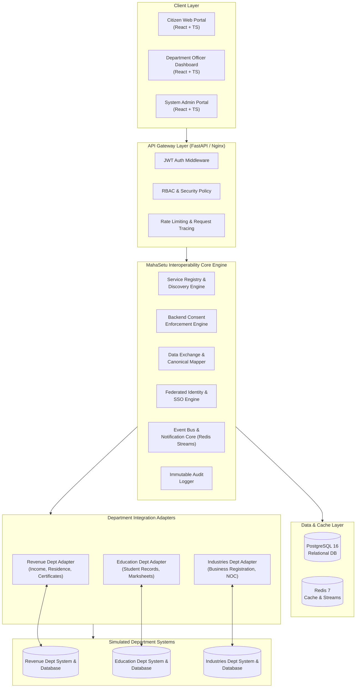
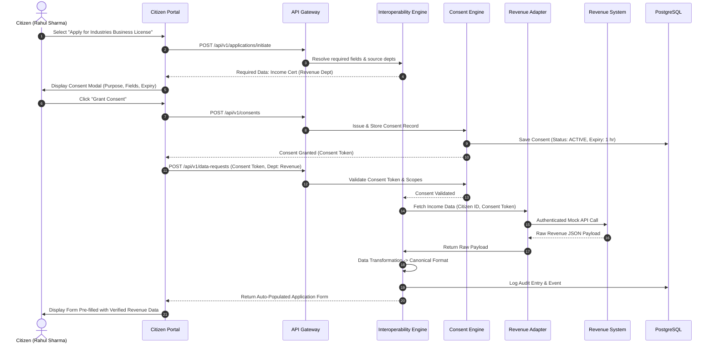
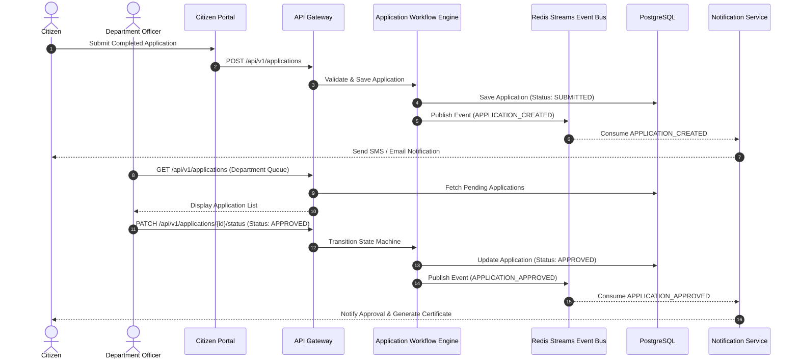

# MAHASETU — System Architecture & Interoperability Blueprint

## 1. High-Level System Architecture

MahaSetu operates as an **Interoperability & Data Exchange Core (Middleware Gateway)** connecting disparate government departmental systems, registries, and citizen-facing services.



---

## 2. Core Architectural Components

### A. API Gateway & Middleware Layer
- **Authentication:** Validates OAuth2 / JWT tokens issued by MahaSetu Federated Identity Engine.
- **Role-Based Access Control (RBAC):** Restricts endpoints based on system roles (`CITIZEN`, `DEPARTMENT_OFFICER`, `DEPARTMENT_ADMIN`, `SYSTEM_ADMIN`).
- **Request Tracing:** Assigns a unique `X-Request-ID` (UUIDv4) to every incoming request for end-to-end distributed tracing across departmental calls.
- **Rate Limiting:** Enforces per-IP and per-user request limits via Redis token bucket.

### B. Interoperability Core Engine
1. **Service Registry:** A dynamic registry where government departments publish available APIs, data contracts, input requirements, output schemas, and security scopes.
2. **Backend Consent Engine:** Enforces user-granted data sharing authorizations. Requests fail hard with `403 Consent Required` unless a valid, unexpired, purpose-bound consent token exists.
3. **Data Exchange & Canonical Mapper:** Translates proprietary department data formats into standardized MahaSetu Canonical Schemas (e.g. `CitizenProfileCanonical`, `CertificateCanonical`).
4. **Federated Identity & SSO Engine:** Single Sign-On broker mapping unified Citizen ID to internal departmental IDs without storing unnecessary raw personal data.
5. **Event Bus (Redis Streams):** Asynchronous pub/sub processing application workflow changes (`APPLICATION_CREATED`, `CONSENT_GRANTED`, `DATA_REQUESTED`, `APPLICATION_APPROVED`).
6. **Immutable Audit Logger:** Writes structured audit records (`timestamp`, `actor_id`, `role`, `action`, `resource`, `result`, `request_id`) to PostgreSQL audit tables with optional SHA-256 hash chaining.

### C. Department Adapters (Mock Integration Layer)
- Isolated Python modules implementing standardized `IDepartmentAdapter` interfaces:
  - `RevenueAdapter.fetch_income_certificate(citizen_id, consent_token)`
  - `RevenueAdapter.fetch_residence_details(citizen_id, consent_token)`
  - `EducationAdapter.fetch_degree_verification(student_id, consent_token)`
  - `IndustriesAdapter.verify_license_status(business_id, consent_token)`

---

## 3. Core Workflow Sequence Diagrams

### Workflow 1: Consent-Based Cross-Department Data Exchange



---

### Workflow 2: Unified Application Lifecycle & Event Processing



---

## 4. Canonical Data Model Architecture

To avoid N×M integration complexity between $N$ citizen portals and $M$ government databases, MahaSetu enforces a **Canonical Data Model (CDM)**:

```
[ Revenue Dept Schema ]    ---> [ Revenue Adapter ]    ---\
[ Education Dept Schema ]  ---> [ Education Adapter ]  ----> [ Canonical Data Mapper ] ---> [ MahaSetu Canonical Model ]
[ Industries Dept Schema ] ---> [ Industries Adapter ] ---/
```

### Canonical Data Schemas:
- **`CitizenIdentityCanonical`**: Standardized name, DOB, gender, mobile, email, primary address.
- **`IncomeCertificateCanonical`**: Standardized certificate number, annual income, issuing authority, issue date, validity status.
- **`BusinessLicenseCanonical`**: Registration number, enterprise name, category, operational address, validity date.

---

## 5. Security & Boundary Controls
1. **Zero-Trust Departmental Communication:** Adapters authenticate via mutual TLS / HMAC signed API keys.
2. **Data Minimization:** MahaSetu does not act as a permanent store for department records; it proxies and transforms data on-demand during application submission.
3. **Immutability of Audit Trails:** Audit log entries are insert-only and cannot be updated or deleted by any user or administrator role.
