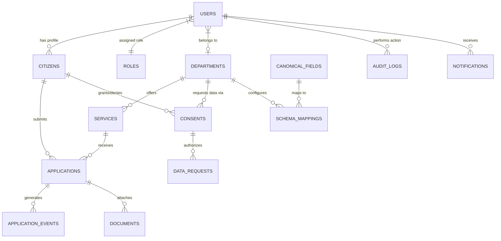

# MAHASETU — Database Schema & Relational Model

## 1. Entity Relationship Diagram (ERD)

---

## 2. PostgreSQL Table Specifications

### 2.1 Core Identity & RBAC Tables

#### Table: `roles`
| Column Name | Data Type | Constraints | Description |
|-------------|-----------|-------------|-------------|
| `id` | VARCHAR(32) | PRIMARY KEY | Role identifier (`CITIZEN`, `DEPARTMENT_OFFICER`, `DEPARTMENT_ADMIN`, `SYSTEM_ADMIN`) |
| `name` | VARCHAR(64) | NOT NULL | Human readable role name |
| `description` | TEXT | NULL | Role description |
| `created_at` | TIMESTAMPTZ | DEFAULT NOW() | Record creation timestamp |

#### Table: `users`
| Column Name | Data Type | Constraints | Description |
|-------------|-----------|-------------|-------------|
| `id` | UUID | PRIMARY KEY, DEFAULT gen_random_uuid() | Unique user GUID |
| `email` | VARCHAR(255) | UNIQUE, NOT NULL | User login email |
| `password_hash` | VARCHAR(255) | NOT NULL | Argon2id/bcrypt hashed password |
| `full_name` | VARCHAR(128) | NOT NULL | Full legal name |
| `phone` | VARCHAR(20) | UNIQUE, NOT NULL | Contact phone number |
| `role_id` | VARCHAR(32) | FK -> `roles(id)` | Assigned system role |
| `department_id` | VARCHAR(64) | FK -> `departments(id)`, NULLABLE | Null for citizens |
| `is_active` | BOOLEAN | DEFAULT TRUE | Account active flag |
| `created_at` | TIMESTAMPTZ | DEFAULT NOW() | Account creation time |

#### Table: `citizens`
| Column Name | Data Type | Constraints | Description |
|-------------|-----------|-------------|-------------|
| `id` | UUID | PRIMARY KEY, FK -> `users(id)` | Associated user account |
| `national_id_hash` | VARCHAR(64) | UNIQUE, NOT NULL | SHA-256 hash of mock National ID (Aadhaar/PAN) |
| `date_of_birth` | DATE | NOT NULL | Date of birth |
| `gender` | VARCHAR(16) | NOT NULL | Gender (`MALE`, `FEMALE`, `OTHER`) |
| `address_line1` | VARCHAR(255) | NOT NULL | Address street details |
| `city` | VARCHAR(100) | NOT NULL | City/Town |
| `district` | VARCHAR(100) | NOT NULL | District |
| `pincode` | VARCHAR(10) | NOT NULL | Postal code |

---

### 2.2 Department & Service Registry Tables

#### Table: `departments`
| Column Name | Data Type | Constraints | Description |
|-------------|-----------|-------------|-------------|
| `id` | VARCHAR(64) | PRIMARY KEY | Department code (`dept_revenue`, `dept_industries`, `dept_education`) |
| `code` | VARCHAR(16) | UNIQUE, NOT NULL | Short code (`REV`, `IND`, `EDU`) |
| `name` | VARCHAR(128) | NOT NULL | Full department name |
| `description` | TEXT | NULL | Department scope and duties |
| `api_base_url` | VARCHAR(255) | NOT NULL | Base endpoint for mock adapter |
| `contact_email` | VARCHAR(255) | NOT NULL | Nodal officer email |
| `status` | VARCHAR(20) | DEFAULT 'ACTIVE' | `ACTIVE`, `MAINTENANCE`, `INACTIVE` |

#### Table: `services`
| Column Name | Data Type | Constraints | Description |
|-------------|-----------|-------------|-------------|
| `id` | VARCHAR(64) | PRIMARY KEY | Service code (`srv_ind_biz_license`) |
| `department_id` | VARCHAR(64) | FK -> `departments(id)` | Owning department |
| `name` | VARCHAR(128) | NOT NULL | Service title |
| `code` | VARCHAR(32) | UNIQUE, NOT NULL | Unique service code |
| `description` | TEXT | NOT NULL | Service details and requirements |
| `required_data_sources` | JSONB | NOT NULL | Array of required department sources & fields |
| `status` | VARCHAR(20) | DEFAULT 'ACTIVE' | `ACTIVE`, `DRAFT`, `DEPRECATED` |

---

### 2.3 Consent Engine Tables

#### Table: `consents`
| Column Name | Data Type | Constraints | Description |
|-------------|-----------|-------------|-------------|
| `id` | UUID | PRIMARY KEY, DEFAULT gen_random_uuid() | Unique consent GUID |
| `citizen_id` | UUID | FK -> `citizens(id)` | Granting citizen |
| `requesting_department_id` | VARCHAR(64) | FK -> `departments(id)` | Recipient department |
| `providing_department_id` | VARCHAR(64) | FK -> `departments(id)` | Data owner department |
| `service_id` | VARCHAR(64) | FK -> `services(id)` | Service context |
| `purpose` | TEXT | NOT NULL | Explicit purpose statement shown to citizen |
| `requested_fields` | JSONB | NOT NULL | Array of field names requested |
| `consent_token` | VARCHAR(128) | UNIQUE, NULLABLE | Signed consent verification token |
| `status` | VARCHAR(20) | DEFAULT 'PENDING' | `PENDING`, `ACTIVE`, `DENIED`, `EXPIRED`, `REVOKED` |
| `created_at` | TIMESTAMPTZ | DEFAULT NOW() | Consent request time |
| `expires_at` | TIMESTAMPTZ | NOT NULL | Consent expiry time |

#### Table: `data_requests`
| Column Name | Data Type | Constraints | Description |
|-------------|-----------|-------------|-------------|
| `id` | UUID | PRIMARY KEY, DEFAULT gen_random_uuid() | Unique request GUID |
| `consent_id` | UUID | FK -> `consents(id)` | Authorizing consent |
| `providing_department_id` | VARCHAR(64) | FK -> `departments(id)` | Target department |
| `data_type` | VARCHAR(64) | NOT NULL | Data type code (`INCOME_CERTIFICATE`) |
| `raw_response_hash` | VARCHAR(64) | NOT NULL | SHA-256 hash of original mock response |
| `status` | VARCHAR(20) | DEFAULT 'SUCCESS' | `SUCCESS`, `FAILED`, `TIMEOUT` |
| `created_at` | TIMESTAMPTZ | DEFAULT NOW() | Timestamp of data exchange |

---

### 2.4 Application & Tracking Tables

#### Table: `applications`
| Column Name | Data Type | Constraints | Description |
|-------------|-----------|-------------|-------------|
| `id` | UUID | PRIMARY KEY, DEFAULT gen_random_uuid() | Unique internal application GUID |
| `application_number` | VARCHAR(32) | UNIQUE, NOT NULL | Public tracking number (`MH-2026-000123`) |
| `citizen_id` | UUID | FK -> `citizens(id)` | Applying citizen |
| `service_id` | VARCHAR(64) | FK -> `services(id)` | Applied service |
| `department_id` | VARCHAR(64) | FK -> `departments(id)` | Processing department |
| `application_data` | JSONB | NOT NULL | Submitted application fields & canonical links |
| `status` | VARCHAR(32) | DEFAULT 'SUBMITTED' | `SUBMITTED`, `IN_REVIEW`, `APPROVED`, `REJECTED` |
| `created_at` | TIMESTAMPTZ | DEFAULT NOW() | Submission timestamp |
| `updated_at` | TIMESTAMPTZ | DEFAULT NOW() | Last state change timestamp |

#### Table: `application_events`
| Column Name | Data Type | Constraints | Description |
|-------------|-----------|-------------|-------------|
| `id` | UUID | PRIMARY KEY, DEFAULT gen_random_uuid() | Unique event GUID |
| `application_id` | UUID | FK -> `applications(id)` | Parent application |
| `event_type` | VARCHAR(64) | NOT NULL | `APPLICATION_CREATED`, `DATA_RECEIVED`, etc. |
| `actor_name` | VARCHAR(128) | NOT NULL | Actor name / system service |
| `description` | TEXT | NOT NULL | Human-readable log entry |
| `metadata` | JSONB | NULL | Event context metadata |
| `created_at` | TIMESTAMPTZ | DEFAULT NOW() | Event creation time |

---

### 2.5 Audit & Observability Tables

#### Table: `audit_logs`
| Column Name | Data Type | Constraints | Description |
|-------------|-----------|-------------|-------------|
| `id` | BIGSERIAL | PRIMARY KEY | Incrementing audit log ID |
| `request_id` | VARCHAR(64) | NOT NULL | Tracing Request UUID |
| `timestamp` | TIMESTAMPTZ | DEFAULT NOW() | Event occurrence time |
| `actor_id` | UUID | NULLABLE | User ID initiating action |
| `actor_role` | VARCHAR(32) | NOT NULL | Role during execution |
| `action` | VARCHAR(64) | NOT NULL | Executed action code (`CONSENT_GRANTED`, etc.) |
| `resource` | VARCHAR(128) | NOT NULL | Target resource URI/name |
| `result` | VARCHAR(20) | NOT NULL | `SUCCESS`, `UNAUTHORIZED`, `FAILURE` |
| `ip_address` | VARCHAR(45) | NOT NULL | Origin IPv4/IPv6 |
| `details` | JSONB | NULL | Additional non-sensitive audit metadata |

---

## 3. Database Indexes & Performance Optimizations
- `idx_users_email` ON `users(email)`
- `idx_applications_app_num` ON `applications(application_number)`
- `idx_applications_citizen` ON `applications(citizen_id)`
- `idx_consents_citizen` ON `consents(citizen_id)`
- `idx_consents_token` ON `consents(consent_token)`
- `idx_audit_logs_request_id` ON `audit_logs(request_id)`
- `idx_audit_logs_timestamp` ON `audit_logs(timestamp DESC)`
